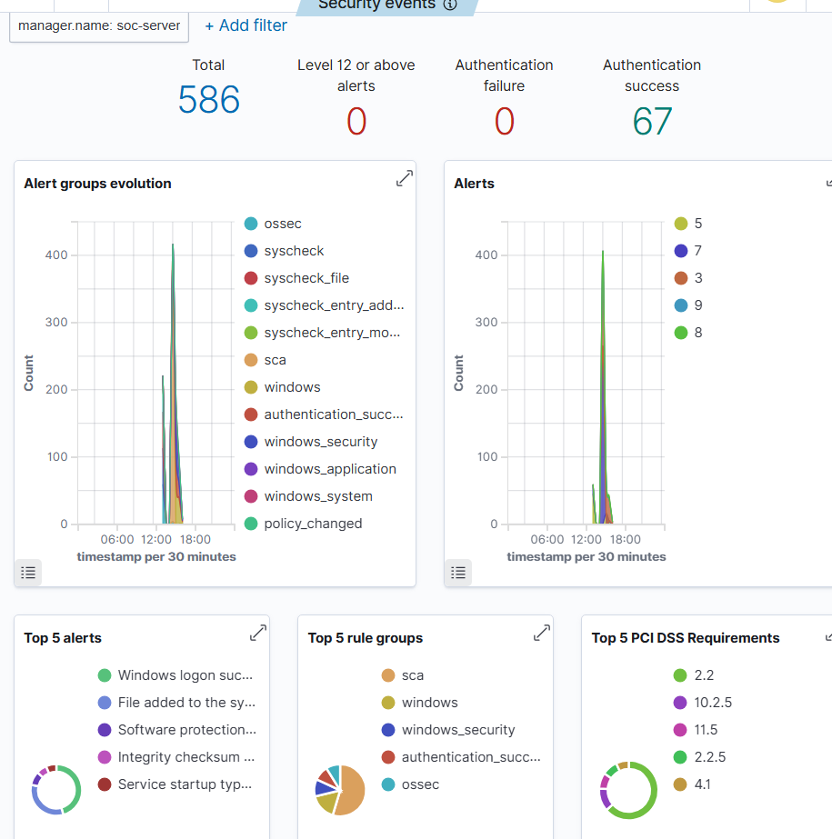
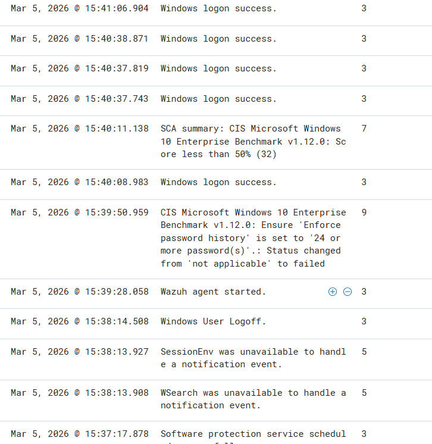
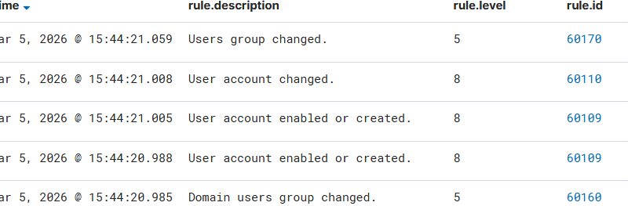
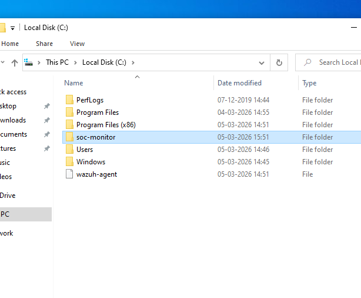

# SOC Monitoring Lab using Wazuh SIEM

## Overview
This project demonstrates a Security Operations Center (SOC) monitoring lab using Wazuh SIEM to collect and analyze Windows security logs.

## Architecture
Kali Linux (Attacker)
↓
Windows Endpoint (Wazuh Agent)
↓
Ubuntu Server (Wazuh SIEM)
↓
Wazuh Dashboard

## Features
- Real-time log monitoring
- Windows endpoint monitoring
- File integrity monitoring
- Privilege escalation detection

## Screenshots

### Wazuh Dashboard

### Security Alerts

### Account Creation Detection

### File Monitoring

